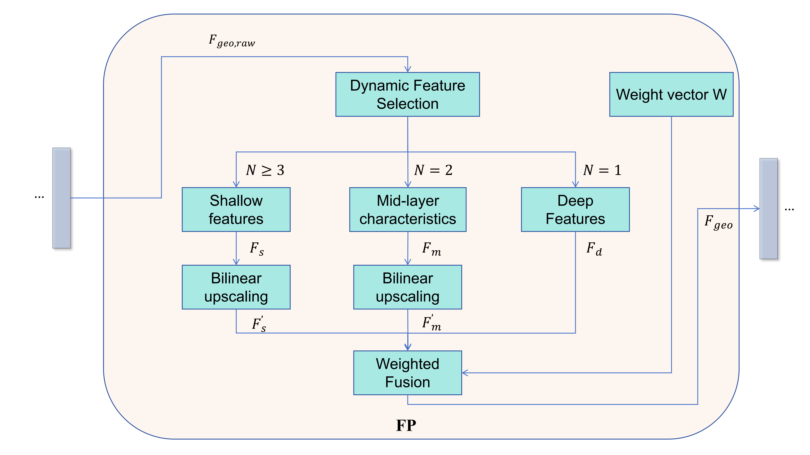

# CFG-NeRF: Coordinate-Feature-Gate Collaborative Optimization for Sparse-View Ancient Architecture Reconstruction

- **Authors**: Lihua Hua, Saiwei Wang, Jianhua Hu, Xiaoling Yao, Sulan Zhang
- **Affiliations**: School of Computer Science and Technology, Taiyuan University of Science and Technology; Institute of Automation, Chinese Academy of Sciences
- **Core Goal**: Address challenges in sparse-view NeRF reconstruction of large-scale ancient architecture (geometric misalignment, insufficient high-low frequency feature synergy, material detail distortion) to enable high-precision digital preservation of cultural heritage

## 1. Project Introduction

CFG-NeRF is an improved framework based on Neural Radiance Field (NeRF), designed specifically for **sparse-view 3D reconstruction of large-scale ancient architecture**. Through the collaborative optimization of three core innovative modules, it achieves state-of-the-art (SOTA) performance on both the self-built *Zhantan Temple Main Hall Dataset* and the public *Multi-scale 360° Dataset*, balancing reconstruction accuracy and efficiency to provide a practical technical solution for digital preservation of cultural heritage.

- Core Contributions:
  1. Propose the MI-MLP module to balance high-low frequency feature gradients and resolve geometric misalignment;
  2. Design a *Multi-scale Feature Pyramid (FP)* module to enhance cross-scale synergy of structural features;
  3. Construct a *Cross-Modal Gated Attention (CGA)* module to fuse physically augmented samples and suppress material distortion.

## 2. Core Challenges

Sparse-view NeRF reconstruction of ancient architecture faces three key problems, which directly affect the fidelity of cultural heritage details:

1. **Geometric Misalignment**: Information attenuation occurs when describing features in complex regions of large scenes. Traditional methods rely on fixed-level positional encoding, leading to reconstruction offsets of architectural structures (e.g., bucket arches, beams, columns);
2. **Insufficient High-Low Frequency Feature Synergy**: Static weights for fusing shallow and deep features fail to adapt to the multi-scale structure of ancient architecture’s *“macro morphology + micro carving”*, easily causing blurred high-frequency textures or distorted low-frequency shapes;
3. **Material Detail Distortion**: Traditional NeRF only relies on original rendering features for modeling (lacking physical constraint calibration), resulting in poor handling of reflective materials in ancient architecture (e.g., lacquered wood, metal ornaments) and causing texture loss or pixel deviation.

## 3. Core Innovative Modules

### 3.1 MI-MLP (Multi-modal Injection MLP)

- **Role**: Balance high-low frequency feature gradients to resolve geometric misalignment.

- Working Principle:

  - *Density branch*: Uses 8-band low-frequency positional encoding. Via a *“coordinate-based layer-wise injection”* mechanism, shallow layers retain high-frequency details while deep layers capture low-frequency geometry;

  - *Color branch*: Combines 16-band high-frequency coordinate encoding and 4-band view encoding, and integrates intermediate features from the density branch to enable *“joint geometry-appearance learning”*.

    

  (Corresponds to Fig. 3 in the paper, showing encoding logic for density/color branches and layer-wise injection flow)

### 3.2 Multi-scale Feature Pyramid (FP) Module

- **Role**: Dynamically optimize cross-scale feature synergy to adapt to “macro structure + micro detail” reconstruction requirements for ancient architecture.

- Working Principle:

  1. *Dynamic feature selection*: Extracts shallow/mid/deep features from MI-MLP’s density branch (feature combinations adapt to layer count);
  2. *Bilinear upsampling*: Unifies spatial dimensions of features across scales to ensure alignment;
  3. *Weighted fusion*: Fuses multi-scale features via preset weight vectors to enhance geometric feature expression.

  

  (Corresponds to Fig. 4 in the paper, showing dynamic feature selection, bilinear upsampling, and weighted fusion)

### 3.3 Cross-Modal Gated Attention (CGA) Module

- **Role**: Fuses physically augmented samples to suppress reflective material distortion and restore details (e.g., lacquered wood, stone carvings) in ancient architecture.

- Working Principle:

  1. *Generate physically augmented samples*: Performs brightness adjustment (β~U(1.8,2.2)) and affine transformation (rotation ±30°, translation [-10,10]) on original color features;
  2. *Multi-dimensional attention calculation*: Computes spatial and channel attention separately, then fuses them to generate pixel-level gating weights;
  3. *Cross-modal fusion*: Concatenates original features, augmented samples, and attention weights, then optimizes material features via grouped convolution.

  

  (Corresponds to Fig. 5 in the paper, showing physical augmentation, attention weight calculation, and cross-modal fusion logic)

## 4. Overall Network Architecture

CFG-NeRF extends the *ZipNeRF* baseline, integrating three innovative modules to enable end-to-end sparse-view reconstruction.

- Architecture Flow:

  1. *Preprocessing*: Input images, camera parameters, near/far planes; generate truncated cones and Gaussian sampling groups via two-stage sampling;
  2. *Feature extraction*: MI-MLP processes density and color branches separately to output multi-scale raw geometry/color features;
  3. *Feature optimization*: FP optimizes geometric features; CGA optimizes color features;
  4. *Rendering output*: Concatenates optimized geometry and color features; predicts volume density and RGB color via a 3-layer MLP to complete reconstruction.

  

  (Corresponds to Fig. 2 in the paper, showing the full pipeline from input to rendering, with module positions marked)

## 5. Experimental Results

### 5.1 Dataset Description

| Dataset                               | Data Scale                               | Scene Characteristics                                      | Purpose                                    |
| ------------------------------------- | ---------------------------------------- | ---------------------------------------------------------- | ------------------------------------------ |
| *Zhantan Temple Dataset* (self-built) | 44 4K images (32 train + 12 test)        | Ancient architecture (backlighting/strong/normal lighting) | Verify ancient architecture reconstruction |
| *Multi-scale 360° Dataset* (public)   | 12 independent scenes (outdoor-dominant) | Includes camera parameters, depth maps, semantic labels    | Verify cross-scene generalization          |

### 5.2 Quantitative Results (*Zhantan Temple Dataset*)

| Method             | PSNR (dB) | SSIM      | LPIPS     | Training Time (hrs) |
| ------------------ | --------- | --------- | --------- | ------------------- |
| NeRF               | 14.92     | 0.526     | 0.432     | 14.85               |
| InstantNGP         | 15.53     | 0.582     | 0.344     | 0.49                |
| ZipNeRF (Baseline) | 19.55     | 0.655     | 0.263     | 1.35                |
| **CFG-NeRF**       | **22.73** | **0.735** | **0.174** | **1.18**            |

- **Key Conclusion**: Compared to ZipNeRF, CFG-NeRF improves PSNR by 16.27%, SSIM by 12.21%, LPIPS by 33.84%, with shorter training time.

### 5.3 Quantitative Results (*360° Dataset*)

| Method             | PSNR (dB) | SSIM      | LPIPS     | Training Time (hrs) |
| ------------------ | --------- | --------- | --------- | ------------------- |
| ZipNeRF (Baseline) | 28.54     | 0.828     | 0.189     | 0.89                |
| **CFG-NeRF**       | **28.98** | **0.843** | **0.171** | **0.76**            |

- **Key Conclusion**: CFG-NeRF maintains SOTA performance in non-ancient architecture scenes, verifying generalization.

### 5.4 Qualitative Results

- Insert Image 1:

  

  

  (Corresponds to Fig. 6/7 in the paper, showing reconstruction comparisons of NeRF, mip-NeRF360, ZipNeRF, and CFG-NeRF; highlight enlarged views of details like bucket arches, plaques, stone carvings)

- Insert Image 2:

  

  (Corresponds to Fig. 8 in the paper, showing reconstruction comparisons of scale textures and light-shadow transitions for pinecones)

### 5.5 Ablation Study (Module Effectiveness)

| Model Configuration     | PSNR (dB) | SSIM      | LPIPS     | Training Time (hrs) |
| ----------------------- | --------- | --------- | --------- | ------------------- |
| ZipNeRF (Baseline)      | 19.55     | 0.655     | 0.265     | 1.18                |
| + MI-MLP                | 21.97     | 0.716     | 0.191     | 1.32                |
| + MI-MLP + FP           | 22.23     | 0.726     | 0.183     | 1.34                |
| **+ MI-MLP + FP + CGA** | **22.73** | **0.735** | **0.174** | **1.35**            |

- **Key Conclusion**: The three modules synergize optimally; individual modules also improve performance (e.g., MI-MLP boosts geometric accuracy, CGA enhances material fidelity).

## 6. Parameter Configuration

### 6.1 Environmental Requirements

- **System**: Ubuntu 22.04
- **Software**: Python 3.10, PyTorch 2.1.0, CUDA 12.1
- **Hardware**: Intel Xeon Gold 6330 CPU, NVIDIA RTX 3090 (24GB VRAM), 90GB memory

### 6.2 Core Training Parameters

| Parameter                | Value                                           |
| ------------------------ | ----------------------------------------------- |
| Learning rate            | Initial 0.01; reduced to 0.001 after 2500 steps |
| Rays per batch           | 8192                                            |
| Iterations               | 20,000                                          |
| Hierarchical sampling    | (0,0,64), (1,1,64), (2,2,32)                    |
| Hash encoding table size | 2,097,152                                       |
| Mip-MLP scale factors    | 0.5/1.0/2.0/4.0                                 |

## 7. Usage Guide

### 7.1 Environment Setup

```bash
# Clone repository
git clone https://github.com/wangsaiweiwsw/CFG-NeRF.git
cd CFG-NeRF

# Install dependencies
pip install -r requirements.txt
```

### 7.2 Data Preparation

1. Dataset structure (example):

   plaintext

   ```plaintext
   data/
   ├── zhantan_temple/  # Zhantan Temple Dataset
   │   ├── images/      # Train/test images (32 train + 12 test)
   │   ├── poses_bounds.npy  # Camera params & near/far planes
   │   └── transforms_train.json  # Training config
   └── 360_dataset/     # Public 360° dataset (official format)
   ```

2. For custom datasets: Generate camera parameter files (refer to NeRF’s official format).

### 7.3 Training Commands

bash

```bash
# Train on Zhantan Temple Dataset
python train.py --config configs/zhantan_temple.yaml

# Train on 360° Dataset
python train.py --config configs/360_dataset.yaml
```

### 7.4 Testing & Visualization

```bash
# Test & generate reconstructed images
python test.py --config configs/zhantan_temple.yaml --ckpt weights/best_model.pth

# Visualize results (generate novel views)
python visualize.py --config configs/zhantan_temple.yaml --ckpt weights/best_model.pth
```

## 8. Future Work

1. Integrate LiDAR data to improve reconstruction robustness in weak-texture areas (e.g., walls, tiles);
2. Construct *temporal radiance fields* to simulate natural aging of ancient architecture (e.g., fading, weathering);
3. Lightweight model deployment for mobile on-site reconstruction to adapt to field cultural heritage collection.

## 9. Acknowledgments

This work is supported by the **National Natural Science Foundation of China (Project No.: 62273248)**. We thank Taiyuan University of Science and Technology, the Institute of Automation, CAS, and all personnel involved in dataset collection/annotation for their support.

## 10. References

- Original paper: Hua L, Wang S, Hu J, et al. *CFG-NeRF: Coordinate-Feature-Gate Collaborative Optimization for Sparse-View Ancient Architecture Reconstruction*[J]. (please insert full citation here)
- Related work: Mildenhall B, et al. *NeRF: Representing scenes as neural radiance fields for view synthesis*[C]//ECCV 2020.

- Baseline: Barron J T, et al. *Zip-NeRF: Combining scale-aware anti-aliasing and grid-based acceleration*[J]. arXiv:2305.12970, 2023.


